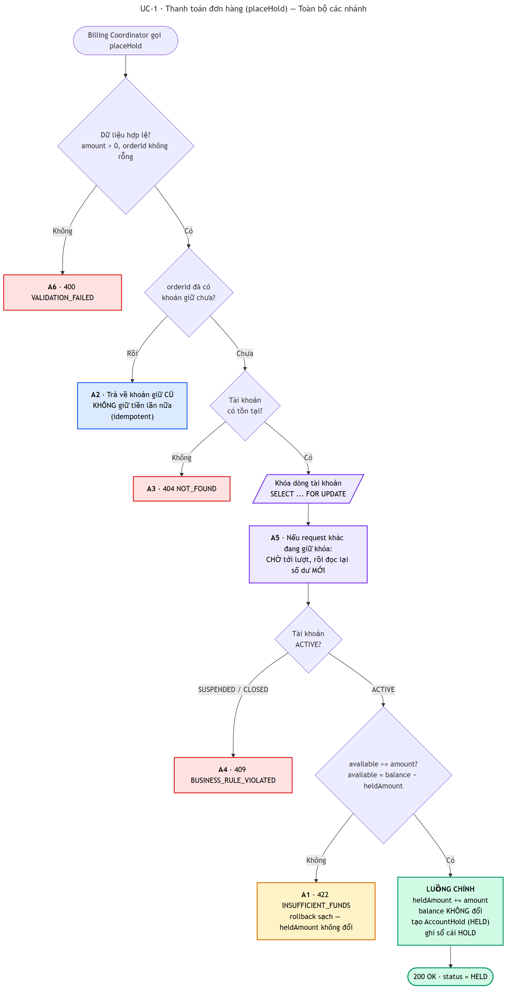
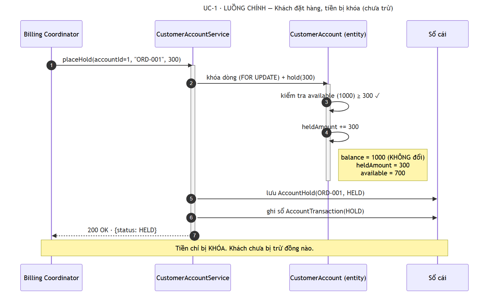
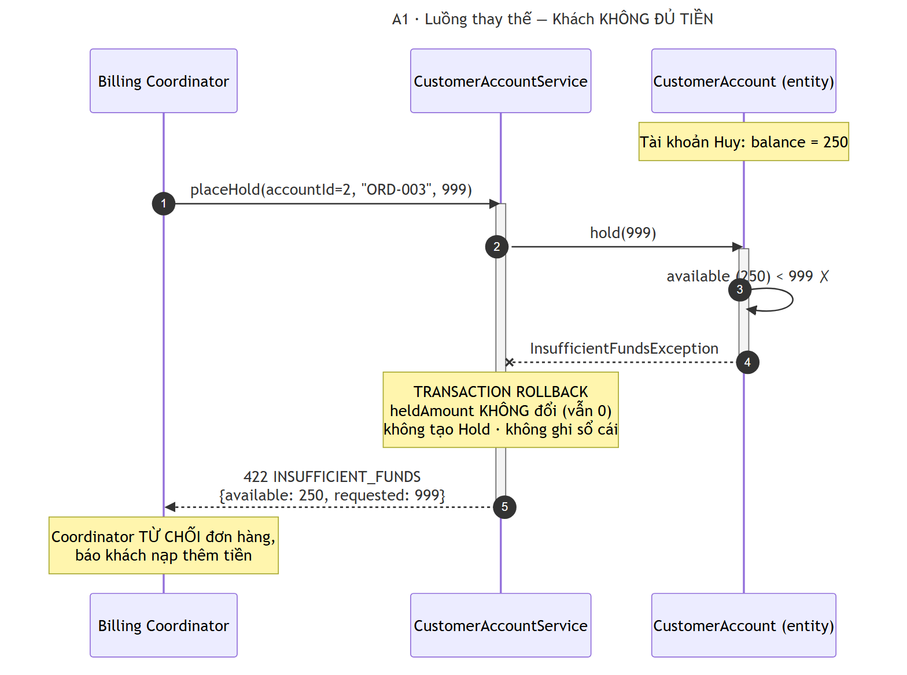
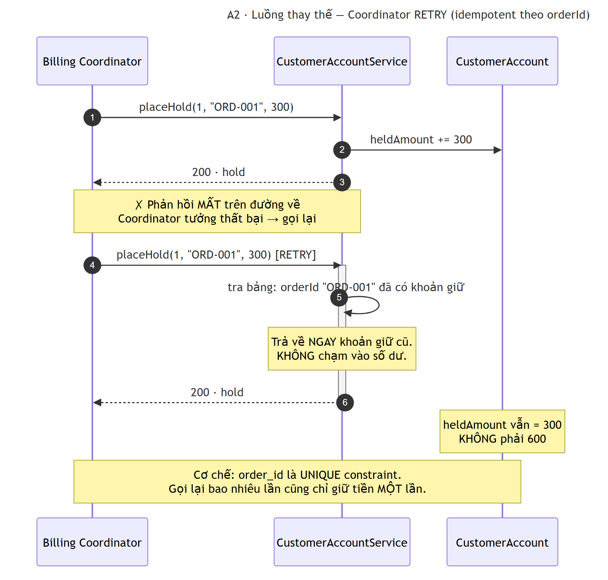
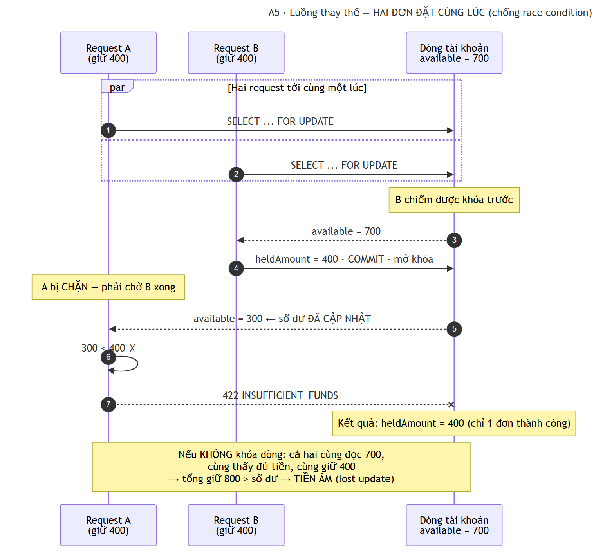
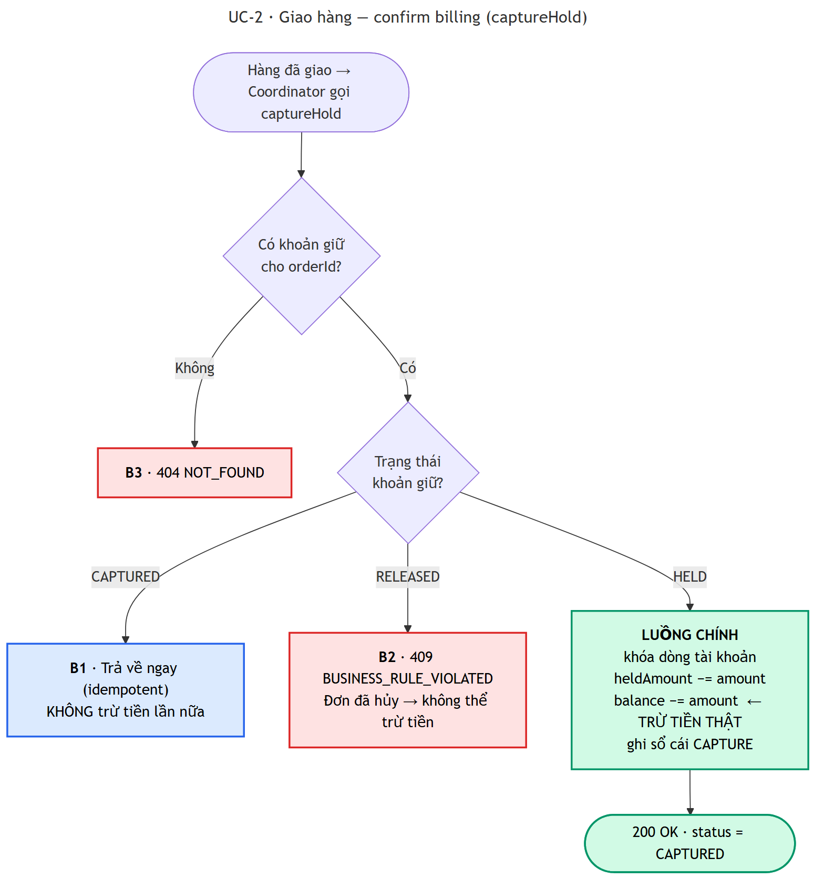
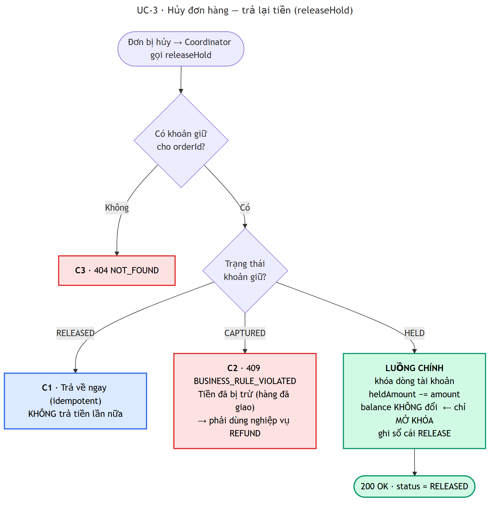
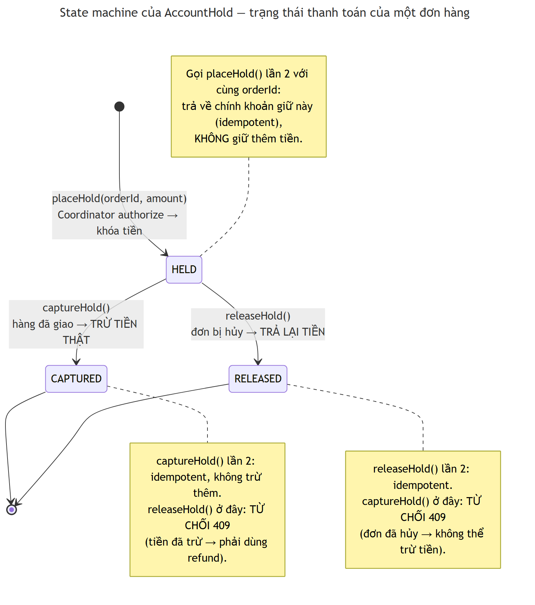
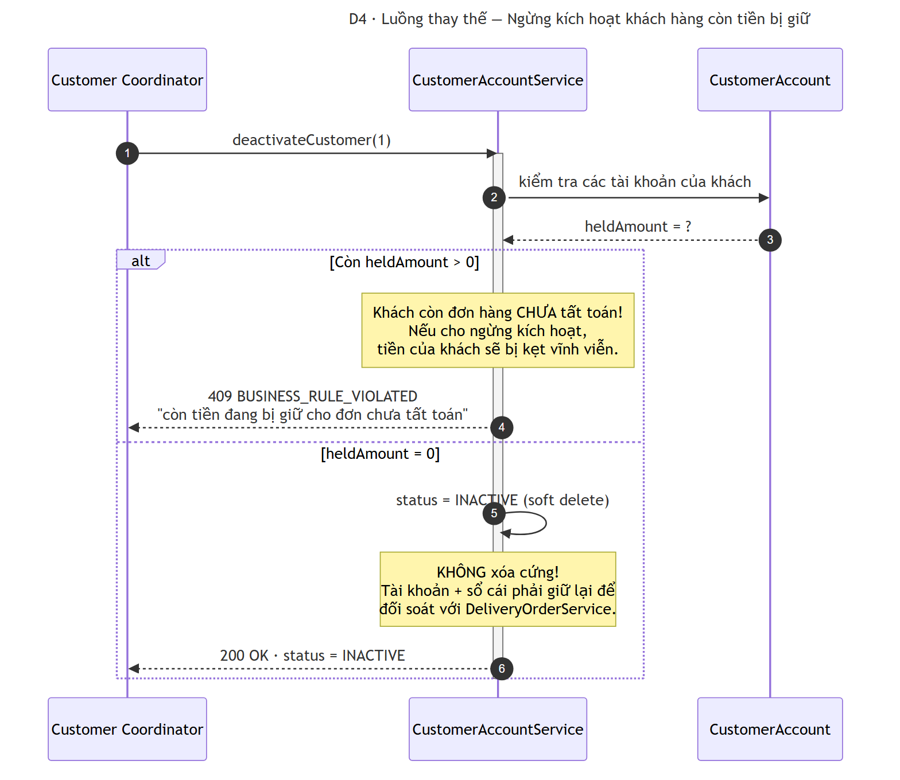
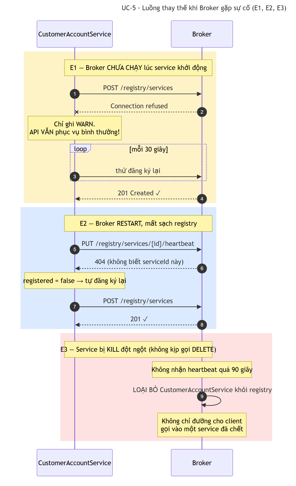

# Luồng chính & luồng thay thế — CustomerAccountService

**Online Shopping System (SWD392)** · Nguyễn Thế Minh

> Liệt kê **mọi nhánh** có thể xảy ra khi Billing Coordinator và Customer Coordinator gọi tới
> `CustomerAccountService`. Mỗi luồng thay thế có: điều kiện kích hoạt, hành vi hệ thống, mã HTTP
> trả về, và test chứng minh.
>
> Toàn bộ sơ đồ đã render sẵn ra **file PNG** trong [`images/`](images/) — chèn thẳng vào báo cáo Word được.

---

## UC-1: Thanh toán đơn hàng — authorize

**Tác nhân:** Billing Coordinator · **Thao tác:** `placeHold(accountId, orderId, amount)`

### Toàn cảnh mọi nhánh



### Luồng chính



Khách đặt hàng → tiền bị **khóa**, `balance` **không đổi**. Khách chưa bị trừ đồng nào.

---

### A1 — Không đủ tiền ⭐



| | |
|---|---|
| **Kích hoạt** | `available < amount` |
| **Trả về** | **422 `INSUFFICIENT_FUNDS`** kèm `{available, requested, accountNumber}` |
| **Coordinator làm gì** | Từ chối đơn hàng, báo khách nạp thêm tiền |
| **Test** | `hold_khongDuTien_thiTuChoi` |

Sau khi lỗi, `heldAmount` **vẫn là 0** — transaction rollback sạch, không để lại rác.

#### A1-b — Biến thể quan trọng: tiền đang giữ KHÔNG phải tiền tiêu được

```
Tài khoản Huy:  balance = 250,  heldAmount = 200  →  available = 50
placeHold(ORD-104, amount = 100)  →  422
```

Bị từ chối **dù `balance` (250) > `amount` (100)**, vì 200 đã bị khóa cho đơn trước.
→ **Hai đơn hàng không thể tiêu chung một khoản tiền.** Đây chính là lý do tách `balance` và `heldAmount`.

**Test:** `hold_tienDangGiuKhongPhaiTienConTieuDuoc`

---

### A2 — Coordinator gọi lại cùng `orderId` (idempotent) ⭐



| | |
|---|---|
| **Kích hoạt** | Coordinator retry vì timeout / mất gói tin |
| **Trả về** | **200** + chính khoản giữ cũ. **KHÔNG giữ tiền lần thứ hai** |
| **Cơ chế** | `order_id` là UNIQUE constraint trong database |
| **Test** | `hold_goiLaiCungOrderId_thiKhongGiuTienHaiLan` |

**Vì sao bắt buộc:** trong hệ phân tán, request có thể tới nơi và xử lý xong nhưng **phản hồi bị mất trên đường về**. Không idempotent thì mỗi lần mạng chập chờn là khách bị khóa tiền thêm một lần.

---

### A3 — Tài khoản không tồn tại → **404 `NOT_FOUND`**

Coordinator dừng, báo lỗi hệ thống. Đây là lỗi lập trình, không phải lỗi người dùng.
**Test:** `khongTimThayTaiKhoan_thiTraVe404`

### A4 — Tài khoản bị khóa (`SUSPENDED` / `CLOSED`) → **409 `BUSINESS_RULE_VIOLATED`**

Kiểm tra nằm **bên trong entity** (`CustomerAccount.requireActive()`), nên không ai lách được bằng cách gọi một đường khác.

---

### A5 — Hai đơn hàng đặt CÙNG LÚC (race condition) ⭐



| | |
|---|---|
| **Kích hoạt** | Hai request đồng thời trên cùng `accountId` |
| **Hành vi** | Request thứ hai **chờ** khóa, rồi đọc lại số dư **đã cập nhật** |
| **Cơ chế** | `SELECT ... FOR UPDATE` (`PESSIMISTIC_WRITE`) trên dòng tài khoản |

**Nếu KHÔNG có khóa dòng:** cả hai cùng đọc `available = 700`, cùng thấy đủ tiền, cùng giữ 400 → tổng giữ **800 > số dư**. Tiền âm. Đây là lỗi kinh điển *lost update*.

**Đã kiểm chứng thật:** bắn 2 request song song → đúng 1 cái thành công (`HELD 400`), 1 cái bị `422`.

### A6 — Dữ liệu không hợp lệ (`amount <= 0`, `orderId` rỗng…) → **400 `VALIDATION_FAILED`**

**Test:** `duLieuKhongHopLe_thiTraVe400`

---

## UC-2: Giao hàng — confirm billing

**Thao tác:** `captureHold(orderId)` · Hàng đã giao → trừ tiền thật.



| Mã | Luồng thay thế | Kích hoạt | Trả về |
|---|---|---|---|
| **B1** | Capture lần thứ hai | Khoản giữ đã `CAPTURED` | **200** — idempotent, không trừ tiền lần nữa |
| **B2** ⭐ | Đơn đã hủy mà đòi trừ tiền | Khoản giữ đang `RELEASED` | **409 `BUSINESS_RULE_VIOLATED`** |
| **B3** | Đơn không tồn tại | `orderId` không có | **404 `NOT_FOUND`** |

**B2 — vì sao chặn thay vì im lặng bỏ qua:** đơn đã hủy mà hệ thống vẫn đòi trừ tiền tức là **trạng thái đang lệch ở đâu đó**. Im lặng trừ tiền của khách là điều tệ nhất có thể làm — phải báo lỗi to để người ta đi đối soát.

---

## UC-3: Hủy đơn hàng — release

**Thao tác:** `releaseHold(orderId)` · Đơn bị hủy → trả lại tiền.



| Mã | Luồng thay thế | Kích hoạt | Trả về |
|---|---|---|---|
| **C1** | Release lần thứ hai | Khoản giữ đã `RELEASED` | **200** — idempotent |
| **C2** ⭐ | Đơn đã bị trừ tiền rồi | Khoản giữ đang `CAPTURED` | **409** → phải dùng `refund` |
| **C3** | Đơn không tồn tại | `orderId` không có | **404 `NOT_FOUND`** |

**C2:** `release` chỉ **mở khóa** khoản tiền chưa từng bị trừ. Hàng đã giao và tiền đã trừ rồi thì đó là chuyện **hoàn tiền** — bản chất nghiệp vụ khác hẳn, và phải để lại bút toán `REFUND` trong sổ cái.

---

## State machine — trạng thái thanh toán của một đơn hàng



Trạng thái đi **một chiều**: `HELD → CAPTURED` hoặc `HELD → RELEASED`, không quay đầu.

---

## UC-4: Quản lý khách hàng & tài khoản

**Tác nhân:** Customer Coordinator

| Mã | Luồng thay thế | Kích hoạt | Trả về |
|---|---|---|---|
| **D1** | Email đã được đăng ký | `createCustomer` email trùng | **409 `DUPLICATE`** |
| **D2** | Khách đã có tài khoản | `createAccount` lần hai | **409 `BUSINESS_RULE_VIOLATED`** |
| **D3** | Khách đang ngừng kích hoạt | `createAccount` cho khách `INACTIVE` | **409 `BUSINESS_RULE_VIOLATED`** |
| **D4** ⭐ | Ngừng kích hoạt khách còn tiền bị giữ | `deactivateCustomer` khi `heldAmount > 0` | **409 `BUSINESS_RULE_VIOLATED`** |



**Hai điểm thiết kế ở D4:**
1. Không cho ngừng kích hoạt khi còn tiền treo — nếu không, tiền của khách bị **kẹt vĩnh viễn**.
2. **Soft delete**, không xóa cứng — tài khoản và sổ cái phải giữ lại để đối soát với DeliveryOrderService.

---

## UC-5: Luồng thay thế khi Broker gặp sự cố



| Mã | Luồng thay thế | Hành vi |
|---|---|---|
| **E1** | Broker chưa chạy khi service khởi động | Ghi **WARN**, service **vẫn phục vụ API bình thường**, thử lại ở heartbeat kế tiếp (≤30s) |
| **E2** | Broker restart, quên mất service | Heartbeat trả **404** → service **tự đăng ký lại** |
| **E3** | Service chết đột ngột (bị kill) | Không kịp gọi `DELETE`. Broker **tự loại** sau 90s không nhận heartbeat |

**Vì sao service không chết theo Broker (E1):** Broker là điểm chết đơn lẻ của kiến trúc brokered. Nếu Broker sập mà kéo theo cả 4 service cùng sập thì thiết kế quá mong manh. Nhờ vậy **thứ tự khởi động khi demo cũng không còn quan trọng**.

---

## Bảng tổng hợp

| Mã | Luồng thay thế | HTTP | Idempotent | Có test |
|---|---|---|---|---|
| **A1** | Không đủ tiền | **422** | — | ✅ |
| **A1-b** | Tiền đang giữ ≠ tiền tiêu được | **422** | — | ✅ |
| **A2** | Retry cùng `orderId` | 200 | ✅ | ✅ |
| **A3** | Tài khoản không tồn tại | 404 | — | ✅ |
| **A4** | Tài khoản bị khóa | 409 | — | — |
| **A5** | Hai đơn đồng thời (race condition) | 200 + 422 | — | ✅ |
| **A6** | Dữ liệu không hợp lệ | 400 | — | ✅ |
| **B1** | Capture lần hai | 200 | ✅ | ✅ |
| **B2** | Capture đơn đã hủy | 409 | — | ✅ |
| **B3** | Capture đơn không tồn tại | 404 | — | — |
| **C1** | Release lần hai | 200 | ✅ | — |
| **C2** | Release đơn đã trừ tiền | 409 | — | ✅ |
| **C3** | Release đơn không tồn tại | 404 | — | — |
| **D1** | Email trùng | 409 | — | — |
| **D2** | Khách đã có tài khoản | 409 | — | — |
| **D3** | Khách ngừng kích hoạt | 409 | — | — |
| **D4** | Xóa khách còn tiền treo | 409 | — | — |
| **E1** | Broker chưa chạy | — | — | ✅ (chạy thật) |
| **E2** | Broker restart | — | — | ✅ (test Broker) |
| **E3** | Service chết đột ngột | — | — | ✅ (test Broker) |

### Ba nguyên tắc xuyên suốt

**1. Lỗi phân biệt bằng mã HTTP, không phải bằng chuỗi văn bản.** Coordinator ra quyết định dựa trên mã:

| Mã | Ý nghĩa với Coordinator |
|---|---|
| **400** | Lỗi lập trình — sửa request |
| **404** | Lỗi hệ thống — dừng, báo lỗi |
| **409** | **Trạng thái đang lệch** — cần đối soát |
| **422** | **Khách không đủ tiền** — từ chối đơn hàng |

**2. Mọi thao tác đổi tiền đều idempotent.** Retry phải vô hại — điều kiện bắt buộc để hệ phân tán an toàn.

**3. Thất bại thì rollback sạch.** Không bao giờ để lại trạng thái nửa vời (giữ tiền nhưng không tạo hold, hay ngược lại).

---

## Nguồn của sơ đồ

Ảnh PNG trong [`images/`](images/) được render từ mã Mermaid. Muốn sửa sơ đồ:

```bash
npx @mermaid-js/mermaid-cli -i so-do.mmd -o so-do.png -b white -s 2
```

Xem thêm [DESIGN.md](DESIGN.md) — thiết kế tổng thể và lý do các quyết định.