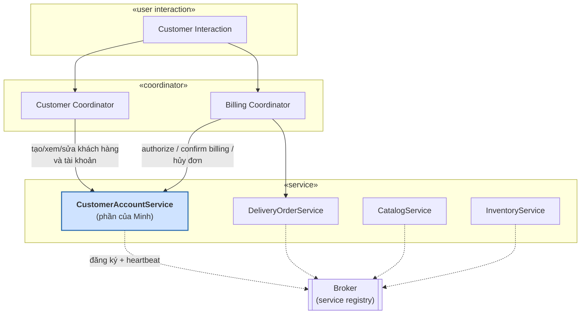
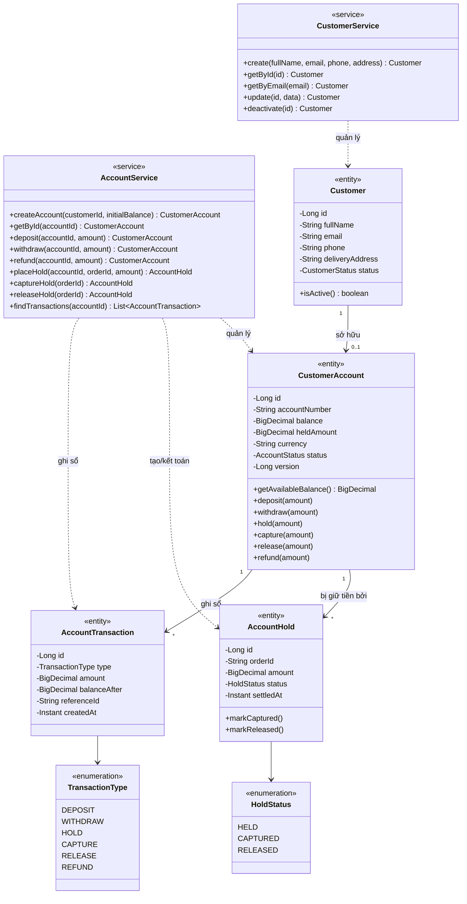
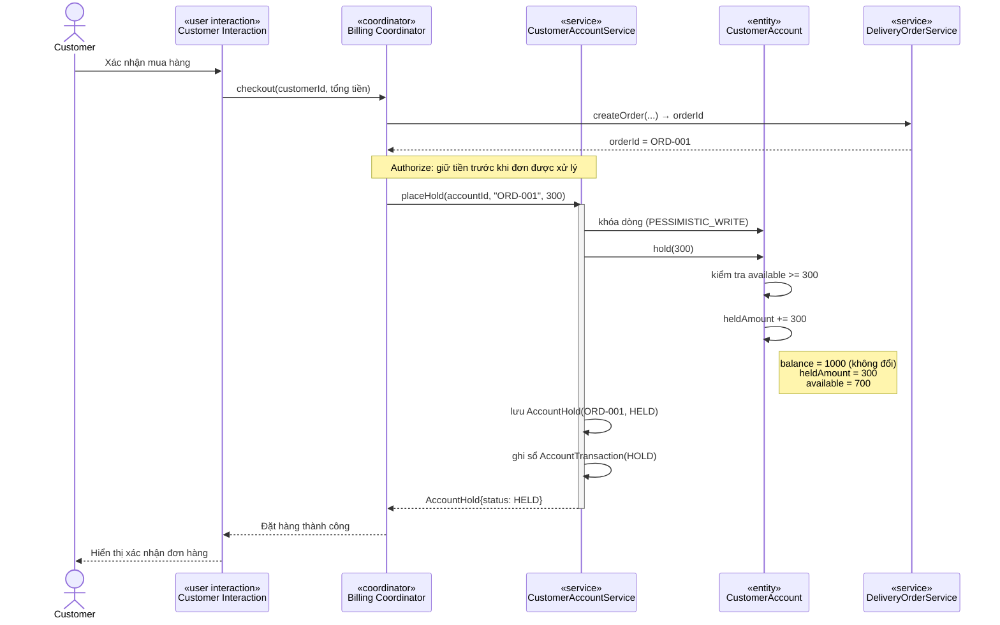
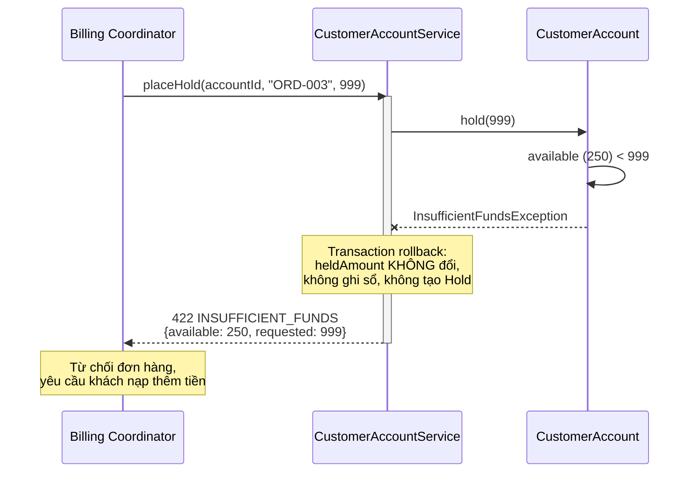
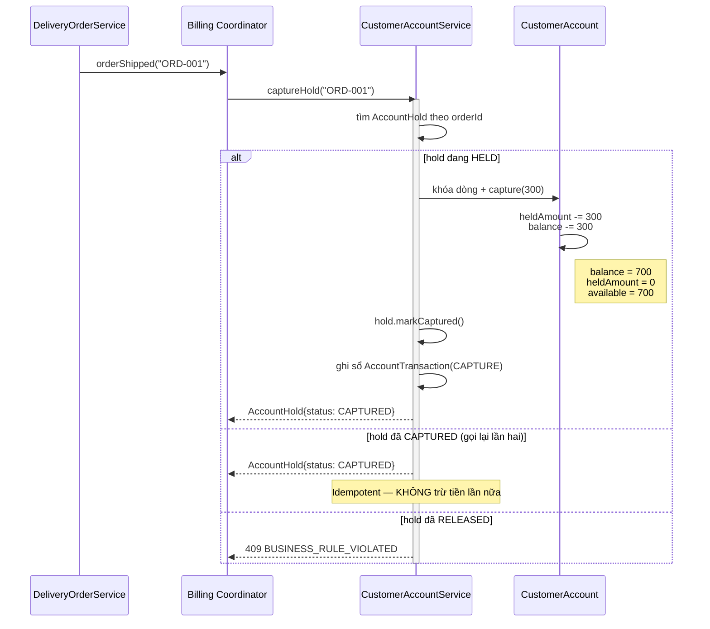
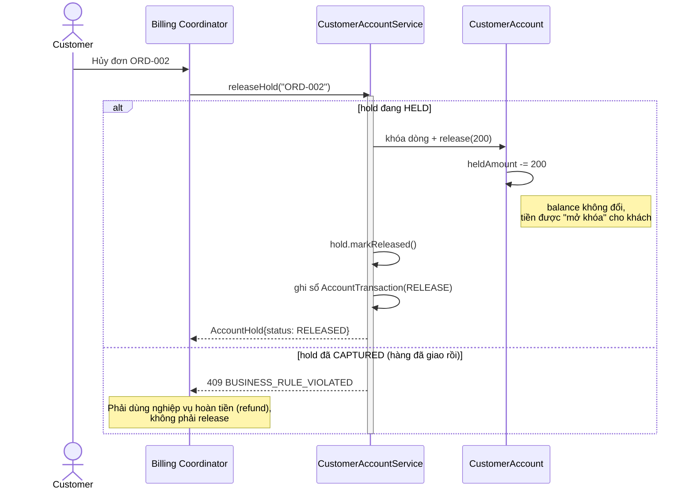
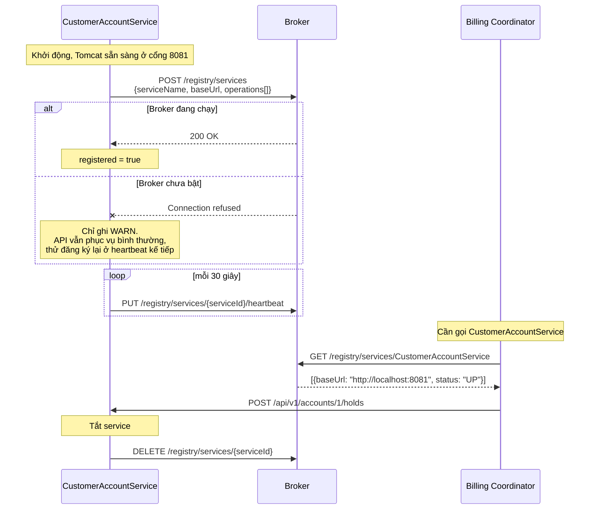
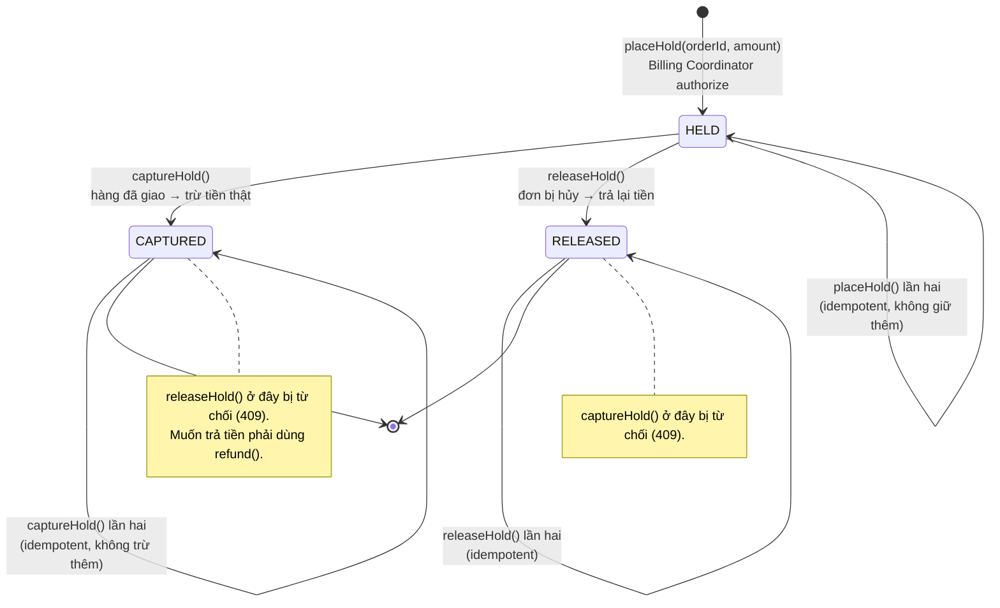
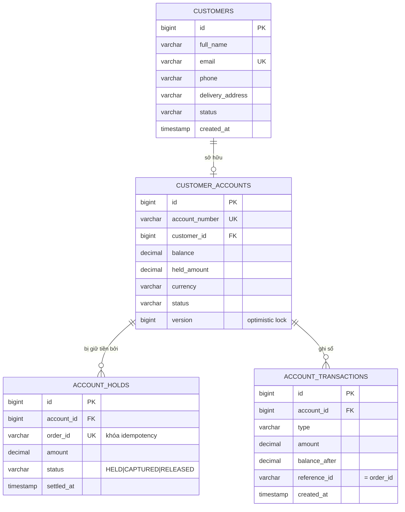

# Thiết kế CustomerAccountService

**Online Shopping System — SWD392**
Người thực hiện: **Nguyễn Thế Minh**

> Tài liệu này mô tả thiết kế của service `CustomerAccountService`, bám theo phương pháp COMET
> (Gomaa) như trong Figure 22.10 và Figure 22.11.

**Mục lục**

1. [Vị trí trong kiến trúc](#1-vị-trí-trong-kiến-trúc)
2. [Mô hình tĩnh — Class diagram](#2-mô-hình-tĩnh--class-diagram)
3. [Đặc tả giao diện service](#3-đặc-tả-giao-diện-service)
4. [Mô hình động — Sequence diagram](#4-mô-hình-động--sequence-diagram)
5. [State machine của AccountHold](#5-state-machine-của-accounthold)
6. [Lược đồ CSDL](#6-lược-đồ-csdl)
7. [Các quyết định thiết kế và lý do](#7-các-quyết-định-thiết-kế-và-lý-do)
8. [Truy vết use case](#8-truy-vết-use-case)

---

## 1. Vị trí trong kiến trúc

Theo Figure 22.11, hệ thống được cấu trúc thành ba loại lớp: `«user interaction»`, `«coordinator»`
và `«service»`. `CustomerAccountService` là một lớp **`«service»`**.

Điều đó quy định rất rõ nó được phép làm gì:

| Đặc điểm của lớp `«service»` | Hệ quả với CustomerAccountService |
|---|---|
| Không khởi xướng giao tiếp, chỉ **trả lời** yêu cầu | Nó không bao giờ tự gọi CatalogService hay InventoryService |
| Không giữ luồng nghiệp vụ (workflow) | Nó **không** biết một đơn hàng đang ở bước nào — Billing Coordinator biết |
| Sở hữu và bảo vệ dữ liệu của mình | Chỉ nó được ghi vào `Customer` và `CustomerAccount` |



**Hai client của service này:**

- **Customer Coordinator** — nghiệp vụ về khách hàng: đăng ký, xem, sửa thông tin, tạo tài khoản, nạp tiền.
- **Billing Coordinator** — nghiệp vụ về tiền của một đơn hàng: giữ tiền khi đặt hàng, trừ tiền khi giao
  hàng, trả lại tiền khi hủy đơn.

---

## 2. Mô hình tĩnh — Class diagram

Figure 22.10 quy định service này bọc hai entity `Customer` và `CustomerAccount`. Thiết kế bổ sung thêm
hai entity **`AccountHold`** và **`AccountTransaction`** — lý do nêu ở [mục 7](#7-các-quyết-định-thiết-kế-và-lý-do).



### Bất biến của `CustomerAccount`

Đây là những điều **luôn đúng** với một tài khoản, và chúng được bảo vệ **bên trong entity** chứ không
phải ở tầng service:

```
balance    >= 0
heldAmount >= 0
heldAmount <= balance
availableBalance = balance - heldAmount     // phần khách thực sự tiêu được
```

| Thao tác | Tiền điều kiện | Hậu điều kiện |
|---|---|---|
| `deposit(a)` | tài khoản ACTIVE | `balance += a` |
| `withdraw(a)` | `available >= a` | `balance -= a` |
| `hold(a)` | `available >= a` | `heldAmount += a` (balance **không đổi**) |
| `capture(a)` | `heldAmount >= a` | `heldAmount -= a`, `balance -= a` |
| `release(a)` | `heldAmount >= a` | `heldAmount -= a` (balance **không đổi**) |
| `refund(a)` | — | `balance += a` |

---

## 3. Đặc tả giao diện service

### 3.1 Nghiệp vụ dành cho Customer Coordinator

| Operation | Tham số vào | Trả về | Ngoại lệ |
|---|---|---|---|
| `createCustomer` | fullName, email, phone, deliveryAddress | Customer | `DUPLICATE` (email đã tồn tại) |
| `getCustomer` | id \| email | Customer | `NOT_FOUND` |
| `updateCustomer` | id, fullName, phone, address | Customer | `NOT_FOUND` |
| `deactivateCustomer` | id | Customer | `NOT_FOUND`, `BUSINESS_RULE_VIOLATED` (còn tiền đang bị giữ) |
| `createAccount` | customerId, initialBalance | CustomerAccount | `NOT_FOUND`, `BUSINESS_RULE_VIOLATED` (đã có tài khoản) |
| `deposit` / `withdraw` | accountId, amount | CustomerAccount | `INSUFFICIENT_FUNDS` (khi rút) |

### 3.2 Nghiệp vụ dành cho Billing Coordinator

| Operation | Tham số vào | Trả về | Ngoại lệ |
|---|---|---|---|
| `placeHold` | accountId, **orderId**, amount | AccountHold (HELD) | `INSUFFICIENT_FUNDS`, `NOT_FOUND` |
| `captureHold` | **orderId** | AccountHold (CAPTURED) | `NOT_FOUND`, `BUSINESS_RULE_VIOLATED` (đơn đã hủy) |
| `releaseHold` | **orderId** | AccountHold (RELEASED) | `NOT_FOUND`, `BUSINESS_RULE_VIOLATED` (đơn đã trừ tiền) |
| `refund` | accountId, amount | CustomerAccount | `NOT_FOUND` |

**Cả ba thao tác trên đều idempotent theo `orderId`.**

### 3.3 Ánh xạ ngoại lệ sang mã HTTP

Coordinator ra quyết định dựa trên **mã trả về**, không phải bằng cách đọc chuỗi lỗi:

| Mã HTTP | `error` | Billing Coordinator làm gì |
|---|---|---|
| 400 | `VALIDATION_FAILED` | Lỗi lập trình, sửa request |
| 404 | `NOT_FOUND` | Dừng, báo lỗi hệ thống |
| 409 | `BUSINESS_RULE_VIOLATED` | Trạng thái đơn hàng bị lệch, cần đối soát |
| 409 | `DUPLICATE` | Báo "email đã tồn tại" cho người dùng |
| **422** | **`INSUFFICIENT_FUNDS`** | **Từ chối đơn hàng, báo khách nạp thêm tiền** |

---

## 4. Mô hình động — Sequence diagram

### 4.1 Đặt hàng — Billing Coordinator authorize (luồng thành công)

Đây là kịch bản chính. Chú ý: **tiền chỉ bị khóa, `balance` chưa đổi.**



### 4.2 Đặt hàng — không đủ tiền (luồng thay thế)



### 4.3 Giao hàng — confirm billing (trừ tiền thật)

Trong sách, khách hàng chỉ **thực sự bị tính tiền khi hàng được giao**. Đó chính là bước `capture`.



### 4.4 Hủy đơn hàng — trả lại tiền



### 4.5 Đăng ký với Broker (Service Registration pattern)



---

## 5. State machine của AccountHold

Mỗi đơn hàng có đúng một `AccountHold`. Trạng thái của nó chính là trạng thái thanh toán của đơn hàng đó.



---

## 6. Lược đồ CSDL



Hai ràng buộc quan trọng nhất:

- `account_holds.order_id` **UNIQUE** → nền tảng của tính idempotent.
- `customer_accounts.version` → optimistic lock, kết hợp với khóa bi quan khi ghi.

---

## 7. Các quyết định thiết kế và lý do

### QĐ-1: Giữ tiền hai bước (hold → capture) thay vì trừ thẳng

**Vấn đề.** Nếu trừ tiền ngay lúc đặt hàng, khi đơn bị hủy hoặc hết hàng ta phải hoàn tiền — sổ sách
sinh ra hai bút toán ngược nhau cho một đơn không hề xảy ra.

**Quyết định.** Lúc đặt hàng chỉ **khóa** tiền (`heldAmount`), chỉ trừ thật khi hàng đã giao.

**Lý do.** Khớp đúng nghiệp vụ trong sách — khách chỉ bị tính tiền khi hàng được giao. Đồng thời phản ánh
đúng cách thẻ tín dụng hoạt động (authorize rồi mới capture), nên sau này ghép với `CreditCardService`
của hệ thống sẽ không phải sửa mô hình.

### QĐ-2: Bất biến về tiền nằm trong entity, không nằm trong service

**Quyết định.** `CustomerAccount.hold()` tự kiểm tra `available >= amount` và tự ném `InsufficientFundsException`.

**Lý do.** Không ai có thể lách qua quy tắc bằng cách gọi một đường khác. Nếu để việc kiểm tra ở tầng
service, mỗi chỗ gọi mới lại phải nhớ kiểm tra lại — sớm muộn sẽ có chỗ quên. Đây là mô hình domain
"béo" (rich domain model), đúng tinh thần lớp `«entity»` của COMET.

### QĐ-3: Idempotent theo `orderId`

**Vấn đề.** Broker/coordinator gọi qua mạng — request có thể bị timeout rồi retry, dù lần đầu **đã** thành
công. Nếu không xử lý, khách sẽ bị giữ tiền (hoặc trừ tiền) hai lần cho cùng một đơn.

**Quyết định.** `order_id` là UNIQUE. `placeHold` gặp `orderId` đã có thì trả về chính khoản giữ cũ.
`captureHold` / `releaseHold` gặp trạng thái đã đúng đích thì trả về luôn, không làm gì thêm.

**Lý do.** Đây là điều kiện bắt buộc để hệ phân tán an toàn: **retry phải vô hại**.

### QĐ-4: Khóa bi quan khi đổi số dư

**Vấn đề.** Hai đơn hàng đặt cùng lúc trên cùng tài khoản có thể cùng đọc `available = 700`, rồi cả hai
cùng giữ 500 → tổng giữ 1000 > số dư. Đây là lỗi kinh điển (race condition / lost update).

**Quyết định.** Mọi thao tác đổi tiền đều đọc tài khoản qua `findByIdForUpdate` (`PESSIMISTIC_WRITE`).

**Lý do.** Hai request bị tuần tự hóa ở tầng CSDL: request thứ hai chờ, và khi tới lượt nó **đọc được số
dư đã cập nhật**. Đây là kiểu dữ liệu (tiền) mà việc thử lại khi xung đột không chấp nhận được, nên khóa
bi quan phù hợp hơn khóa lạc quan.

### QĐ-5: Có sổ cái `AccountTransaction`

**Quyết định.** Mọi thay đổi số dư đều ghi một dòng, kèm `balanceAfter` và `referenceId = orderId`.

**Lý do.** Khi có tranh chấp ("tôi bị trừ tiền hai lần"), phải trả lời được **vì sao số dư ra con số hiện
tại**. Chỉ nhìn `balance` thì không tái dựng được lịch sử. Đây cũng là cơ sở đối soát với DeliveryOrderService.

### QĐ-6: Service vẫn chạy khi Broker chết

**Quyết định.** Đăng ký/heartbeat thất bại chỉ ghi WARN; các API vẫn phục vụ bình thường; heartbeat kế
tiếp sẽ tự đăng ký lại.

**Lý do.** Broker là điểm chết đơn lẻ (single point of failure) của kiến trúc brokered. Nếu Broker sập mà
kéo theo cả 4 service cùng sập thì thiết kế quá mong manh. Ngoài ra thứ tự khởi động các service khi
demo cũng không còn quan trọng.

---

## 8. Truy vết use case

| Use case | Thao tác trên CustomerAccountService | Sequence diagram |
|---|---|---|
| Đăng ký khách hàng | `createCustomer` → `createAccount` | §3.1 |
| Xem / sửa thông tin tài khoản | `getCustomer`, `updateCustomer`, `getAccount` | §3.1 |
| **Đặt hàng** | `placeHold(orderId, amount)` | [§4.1](#41-đặt-hàng--billing-coordinator-authorize-luồng-thành-công) |
| Đặt hàng — không đủ tiền | `placeHold` → 422 | [§4.2](#42-đặt-hàng--không-đủ-tiền-luồng-thay-thế) |
| **Giao hàng (tính tiền)** | `captureHold(orderId)` | [§4.3](#43-giao-hàng--confirm-billing-trừ-tiền-thật) |
| Hủy đơn hàng | `releaseHold(orderId)` | [§4.4](#44-hủy-đơn-hàng--trả-lại-tiền) |
| Khách trả hàng | `refund(accountId, amount)` | — |
| Xem lịch sử giao dịch | `listTransactions(accountId)` | — |

### Bằng chứng kiểm thử

15 test tự động phủ các luồng trên (`./mvnw test`):

| Nhóm | Số test | Nội dung |
|---|---|---|
| `AccountServiceTest` | 9 | hold không đổi balance; capture trừ tiền; release trả tiền; không đủ tiền bị từ chối; tiền đang giữ không tính là tiền tiêu được; hold/capture idempotent; release sau capture bị từ chối; sổ cái ghi đủ các bước |
| `AccountApiTest` | 5 | Đi qua HTTP thật: luồng authorize → capture; hủy đơn; 422 khi thiếu tiền; 400 khi dữ liệu sai; 404 khi không tìm thấy |
| Context | 1 | Ứng dụng khởi động được |
